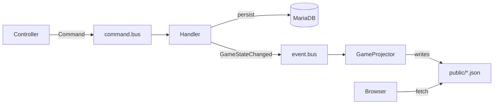

# tickerly

Live score ticker for amateur sport. One person at the venue taps the score and
types what just happened; everyone else follows the game in their browser — no
app, no account, just a link.

The app doubles as a study in CQRS on top of Symfony Messenger: every write goes
through a command bus, and a single domain event drives the projection that the
public pages read from.

The UI is in German. Running at [tickerly.de](https://tickerly.de).

## What it does

- **Public ticker** — upcoming and finished games, and a page per game with the
  live score and the event feed. No login needed to watch.
- **Accounts** — anyone can register; each game belongs to the user who created
  it, and only that user can score or edit it.
- **Ticker controls** — increment or decrement either side, and add timestamped
  events ("67' — Dreier von außen").
- **Admin area** — overview of users and games, and activating or deactivating
  either. A deactivated user keeps their data but can no longer sign in; a
  deactivated game disappears from the public lists.

## How it works

Writes and reads are deliberately separated:



- **Write side.** Controllers never touch entities directly; they dispatch a
  command (`IncreaseHomePoints`, `UpdateGame`, `SetGameActive`, …) on
  `command.bus`. The bus runs validation and wraps each handler in a Doctrine
  transaction.
- **One domain event.** Every mutating handler ends by dispatching the same
  `GameStateChanged` event on `event.bus` — the signal that the read models are
  stale. Handlers do not know what happens next.
- **Read side.** `GameStateChangedHandler` runs `GameProjector`, which rebuilds
  `public/nextgames.json` and `public/lastgames.json`. The files are written to
  a temp name and renamed, so a browser fetching them never sees a half-written
  file. The index page is therefore plain HTML plus two static JSON fetches, and
  the database is never queried to render it.

The trade-off is deliberate and worth knowing before deploying: file-based read
models are fast and dependency-free, but they assume a single instance with a
writable web root. Multiple app servers or a read-only filesystem would need the
projector pointed somewhere shared instead.

Authorization sits in three places: a `GameVoter` grants access to a game only to
its owner, `ROLE_ADMIN` guards `/admin` via `access_control`, and a `UserChecker`
refuses deactivated accounts at the firewall — with the correct password, and
mid-session too.

## Built with

PHP 8.4 · Symfony 7.4 · Doctrine ORM + Migrations · MariaDB 10.11 · Tailwind CSS 4
(via `symfonycasts/tailwind-bundle`, so no Node toolchain) · AssetMapper ·
PHPUnit 13.

## Getting started

You need PHP 8.4, Composer, Docker (for the database) and — recommended — the
[Symfony CLI](https://symfony.com/download).

```bash
git clone https://github.com/muex/tickerly-messenger.git
cd tickerly-messenger
composer install

docker compose up -d database          # MariaDB 10.11 on localhost:3306
php bin/console doctrine:migrations:migrate
php bin/console tailwind:build         # downloads the standalone binary once

symfony serve -d
```

Open http://localhost:8000, register an account and create your first game.

Configuration lives in `.env`; put anything machine-specific into `.env.local`
(git-ignored), in particular `DATABASE_URL` if you are not using the bundled
container. The compose setup also provisions `tickerly_test` for the test suite.

### Becoming an admin

The admin area needs `ROLE_ADMIN`, and nothing hands it out — bootstrap the first
one from the console:

```bash
php bin/console app:user:promote you@example.com     # --demote takes it back
```

`/admin` is then reachable from the top navigation.

## Tests

```bash
php bin/phpunit
```

The suite covers the scoring and activation handlers, ownership authorization,
the deactivated-account check, and a few HTTP smoke tests. It needs no database.

## Layout

```
src/
  Controller/            HTTP entry points, thin: they dispatch commands
  Entity/  Repository/   Doctrine write model
  Form/                  form types
  Security/              authenticator, UserChecker, GameVoter
  Command/               console commands
  Game/
    Application/
      Command/           commands + their handlers
      Event/             GameStateChanged + handler
    Infrastructure/      bus adapters, GameProjector
  Shared/Domain/         Command/Event/bus interfaces
templates/               Twig, styled with Tailwind utility classes
migrations/              schema history, baseline included
```

## Deployment

`.github/workflows/deploy.yml` deploys to shared hosting on every push to `main`:
install without dev dependencies, build the assets, rsync over SSH, run
`doctrine:migrations:migrate`, then clear and warm the prod cache. It expects the
repository variables `SSH_HOST`, `SSH_PORT`, `SSH_USER` and `DEPLOY_PATH`, plus
the secret `SSH_PRIVATE_KEY`. Production keeps its own `.env.local`, which the
sync deliberately leaves alone.

## Status

Working software, still moving. [`TASKS.md`](TASKS.md) tracks what has been done
and what is still open, with the reasoning behind the bigger decisions.

## License

The source is public to read, but `composer.json` declares the project
proprietary — there is no open-source license granting reuse.
